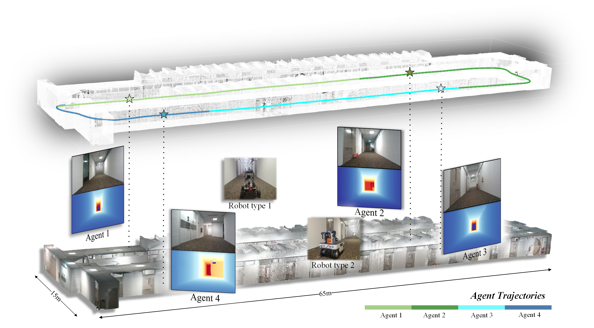
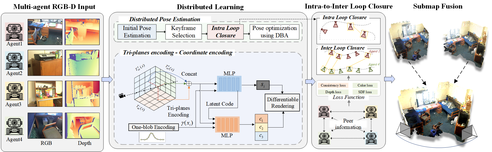

<p align="center">
  <a href="">
    
  </a>
</p>

<h1 align="center">
MNE-SLAM: Multi-Agent Neural SLAM for Mobile Robots
  
[CVPR 2025]
  
[INS Dataset Page](https://ins-dataset.github.io/ins/) | [Paper](https://openaccess.thecvf.com//content/CVPR2025/papers/Deng_MNE-SLAM_Multi-Agent_Neural_SLAM_for_Mobile_Robots_CVPR_2025_paper.pdf)

</h1>
<br>


<p align="center">
  <a href="">
    
  </a>
</p>

<br>
<!-- TABLE OF CONTENTS -->
<details open="open" style='padding: 10px; border-radius:5px 30px 30px 5px; border-style: solid; border-width: 1px;'>
  <summary>Table of Contents</summary>
  <ol>
    <li>
      <a href="#installation">Installation</a>
    </li>
    <li>
      <a href="#demo">Online Demo</a>
    </li>
    <li>
      <a href="#usage">Usage</a>
    </li>
    <li>
      <a href="#downloads">Downloads</a>
    </li>
    <li>
      <a href="#benchmarking">Benchmarking</a>
    </li>
    <li>
      <a href="#acknowledgement">Acknowledgement</a>
    </li>
    <li>
      <a href="#citation">Citation</a>
    </li>
  </ol>
</details>

# Notes

- [x] We have updated the `README.md` and are preparing to open-source our code！  
- [x] Code for main parts, including `optimizer`, `renderer`, `mapping modules`, `Joint Scene Representation`
- [x] Installation setup
- [ ] Multi-agent Communication

# Installation

First you have to make sure that you have all dependencies in place.
The simplest way to do so, is to use [anaconda](https://www.anaconda.com/). 

Please follow the instructions below to install the repo and dependencies.

```bash
git clone https://github.com/dtc111111/MNESLAM.git
cd MNE-SLAM
```
### Install the environment
You can create an anaconda environment called `eslam`. For linux, you need to install **libopenexr-dev** before creating the environment.
```bash
sudo apt-get install libopenexr-dev
    
conda env create -f environment.yaml
conda activate mneslam
```

```bash

# Install the pytorch first (Please check the cuda version)
pip install torch==1.10.1+cu113 torchvision==0.11.2+cu113 torchaudio==0.10.1 -f https://download.pytorch.org/whl/cu113/torch_stable.html

# Install all the dependencies via pip (Note here pytorch3d and tinycudann requires ~10min to build)
pip install -r requirements.txt

# Build extension (marching cubes from neuralRGBD)
cd external/NumpyMarchingCubes
python setup.py install

```
For tinycudann, if you cannot access network when you use GPUs, you can also try build from source as below:

```bash
# Build tinycudann 
git clone --recursive https://github.com/nvlabs/tiny-cuda-nn

# Try this version if you cannot use the latest version of tinycudann
#git reset --hard 91ee479d275d322a65726435040fc20b56b9c991
cd tiny-cuda-nn/bindings/torch
python setup.py install
```


If desired, the Open3D package can be installed in the [headless rendering](http://www.open3d.org/docs/latest/tutorial/Advanced/headless_rendering.html) mode. This is useful for running MNESLAM on a server without a display. We recommend to install from [this commit](https://github.com/isl-org/Open3D/tree/v0.15.1) as we observed bugs in other releases of Open3D.

## Run

### Replica
Download the data as below and the data is saved into the `./Datasets/Replica` folder.
```bash
bash scripts/download_replica.sh
```

### ScanNet
Please follow the data downloading procedure on [ScanNet](http://www.scan-net.org/) website, and extract color/depth frames from the `.sens` file using this [code](https://github.com/ScanNet/ScanNet/blob/master/SensReader/python/reader.py).

<details>
  <summary>[Directory structure of ScanNet (click to expand)]</summary>
  
  DATAROOT is `./Datasets` by default. If a sequence (`sceneXXXX_XX`) is stored in other places, please change the `input_folder` path in the config file or in the command line.

```
  DATAROOT
  └── scannet
      └── scans
          └── scene0000_00
              └── frames
                  ├── color
                  │   ├── 0.jpg
                  │   ├── 1.jpg
                  │   ├── ...
                  │   └── ...
                  ├── depth
                  │   ├── 0.png
                  │   ├── 1.png
                  │   ├── ...
                  │   └── ...
                  ├── intrinsic
                  └── pose
                      ├── 0.txt
                      ├── 1.txt
                      ├── ...
                      └── ...

```
</details>


### TUM RGB-D
Download the data as below and the data is saved into the `./Datasets/TUM` folder.
```bash
bash scripts/download_tum.sh
```
### INS Dataset
Download the data as below and the data is saved into the `./Datasets/INS` folder. You can download the dataset in [INS Dataset Page](https://ins-dataset.github.io/ins/).
<p align="center">
  <a href="">
    
  </a>
</p>

## Run

You can run MNESLAM using the code below:

```
python mneslam.py --config './configs/{Dataset}/{scene}.yaml 
```


You can run MNESLAM with multi-processing using the code below:

```
python mneslam_mp.py --config './configs/{Dataset}/{scene}.yaml 
```


## Evaluation

We employ a slightly different evaluation strategy to measure the quality of the reconstruction, you can find out the code [here](https://github.com/JingwenWang95/neural_slam_eval).


## Acknowledgement

We adapt codes from some awesome repositories, including [NICE-SLAM](https://github.com/cvg/nice-slam), [NeuralRGBD](https://github.com/dazinovic/neural-rgbd-surface-reconstruction), [tiny-cuda-nn](https://github.com/NVlabs/tiny-cuda-nn), [NICE-SLAM](https://github.com/cvg/nice-slam), [iMAP](https://edgarsucar.github.io/iMAP/), [ESLAM](https://github.com/idiap/ESLAM) ,[CoSLAM](https://github.com/HengyiWang/Co-SLAM) Thanks for making the code available.

